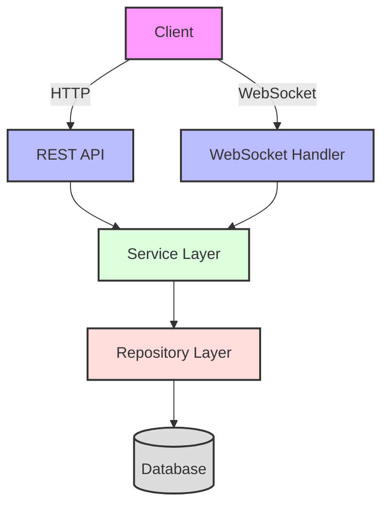

# Collaborative Document Editor

A real-time collaborative document editing application built with Spring Boot and WebSocket technology. Multiple users can simultaneously edit documents while seeing each other's changes in real-time.

```ascii
📁 Project Structure
├── 📂 src/main/java/com/collab/docs
│   ├── 📂 config
│   │   ├── 📄 SecurityConfig.java         # Security configuration
│   │   └── 📄 WebSocketConfig.java        # WebSocket configuration
│   ├── 📂 controller
│   │   ├── 📄 AuthController.java         # Authentication endpoints
│   │   └── 📄 DocumentController.java     # Document management endpoints
│   ├── 📂 model
│   │   ├── 📄 Document.java              # Document entity
│   │   └── 📄 User.java                  # User entity
│   ├── 📂 repository
│   │   ├── 📄 DocumentRepository.java    # Document data access
│   │   └── 📄 UserRepository.java        # User data access
│   ├── 📂 security
│   │   ├── 📄 JwtTokenProvider.java      # JWT token management
│   │   ├── 📄 JwtAuthenticationFilter.java # JWT authentication
│   │   └── 📄 CustomUserDetailsService.java # User details service
│   ├── 📂 service
│   │   ├── 📄 DocumentService.java       # Document business logic
│   │   └── 📄 UserService.java           # User business logic
│   └── 📂 websocket
│       ├── 📄 DocumentWebSocketController.java # WebSocket handler
│       ├── 📄 DocumentEditMessage.java         # Edit message model
│       └── 📄 CollaboratorStatus.java          # Collaborator status
```

## System Architecture



## Features

- 🔐 **Secure Authentication**
  - JWT-based authentication
  - Role-based access control
  - Password encryption

- 📝 **Document Management**
  - Create, read, update, and delete documents
  - Share documents with other users
  - Track document version history

- 👥 **Real-time Collaboration**
  - Multiple users can edit simultaneously
  - See other users' cursor positions
  - Real-time updates via WebSocket

- 🔄 **Synchronization**
  - Automatic conflict resolution
  - Optimistic locking for concurrent edits
  - Change propagation to all connected clients

## Getting Started

### Prerequisites

- Java 11 or higher
- Maven 3.6 or higher
- H2 Database (embedded)

### Installation

1. Clone the repository:
```bash
git clone https://github.com/yourusername/collaborative-docs.git
cd collaborative-docs
```

2. Build the project:
```bash
mvn clean install
```

3. Run the application:
```bash
mvn spring-boot:run
```

The application will start on `http://localhost:8080`

## API Documentation

### Authentication Endpoints

#### Register a new user
```http
POST /api/auth/register
Content-Type: application/json

{
    "username": "john_doe",
    "email": "john@example.com",
    "password": "securepassword"
}
```

#### Login
```http
POST /api/auth/login
Content-Type: application/json

{
    "username": "john_doe",
    "password": "securepassword"
}
```

### Document Endpoints

#### Create a new document
```http
POST /api/documents
Authorization: Bearer <jwt_token>
Content-Type: application/json

{
    "title": "My Document",
    "content": "Initial content"
}
```

#### Get document by ID
```http
GET /api/documents/{id}
Authorization: Bearer <jwt_token>
```

#### Update document
```http
PUT /api/documents/{id}
Authorization: Bearer <jwt_token>
Content-Type: application/json

{
    "title": "Updated Title",
    "content": "Updated content"
}
```

#### Share document with user
```http
POST /api/documents/{id}/share
Authorization: Bearer <jwt_token>
Content-Type: application/json

{
    "username": "jane_doe"
}
```

## WebSocket Protocol

### Connect to WebSocket
```javascript
const socket = new WebSocket('ws://localhost:8080/ws');
```

### Document Edit Message Format
```json
{
    "documentId": "123",
    "operation": "INSERT",
    "position": 10,
    "content": "new text",
    "userId": "user_123"
}
```

## Example Scenarios

### Scenario 1: Collaborative Editing

1. Alice creates a new document:
```http
POST /api/documents
{
    "title": "Team Project",
    "content": "Project goals:"
}
```

2. Alice shares the document with Bob:
```http
POST /api/documents/1/share
{
    "username": "bob"
}
```

3. Both Alice and Bob connect to WebSocket:
```javascript
const socket = new WebSocket('ws://localhost:8080/ws');
```

4. Alice adds content (sent via WebSocket):
```json
{
    "documentId": "1",
    "operation": "INSERT",
    "position": 14,
    "content": "\n1. Complete documentation",
    "userId": "alice_123"
}
```

5. Bob receives the update in real-time and sees the changes.

### Scenario 2: Conflict Resolution

1. Both Alice and Bob try to edit the same position:
   - Alice adds: "Complete documentation"
   - Bob adds: "Finish documentation"

2. The system:
   - Processes requests in order of receipt
   - Applies operational transformation
   - Ensures both users see the same final content
   - Notifies users of merged changes

## Security

- JWT-based authentication
- Password encryption using BCrypt
- CORS configuration for frontend access
- WebSocket endpoint security
- Role-based access control

## Contributing

1. Fork the repository
2. Create your feature branch (`git checkout -b feature/amazing-feature`)
3. Commit your changes (`git commit -m 'Add some amazing feature'`)
4. Push to the branch (`git push origin feature/amazing-feature`)
5. Open a Pull Request

## License

This project is licensed under the MIT License - see the [LICENSE](LICENSE) file for details.
